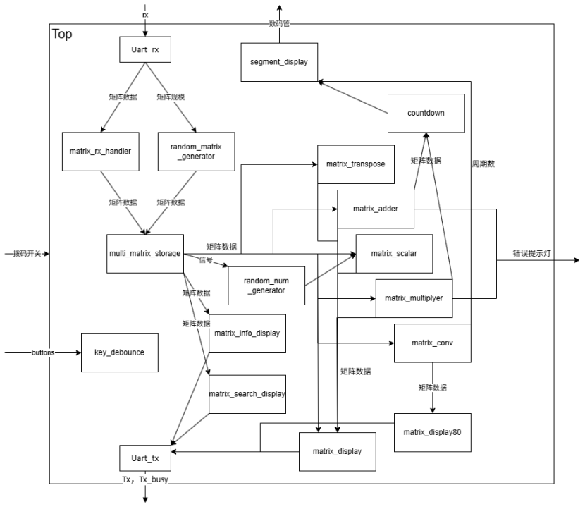

# 25Fall CS207 数字逻辑 Project 
## 项目名称：基于FPGA的矩阵计算器
## 项目成员
- 王惠田 12410214
- 王凯 12410219
- 林茜 12410534
## 项目开发规划
### GitHub地址：
https://github.com/CS207DigitalLogic/final-project-vidado
### 开发日程
| Date | Summary |
|:--:|:--:|
|Nov 27|七段数码管显示模块|
|Dec 8 | 矩阵存储模块 |
|Dec 11| 随机数和随机矩阵模块|
|Dec 12| 矩阵展示模块|
|Dec 14| 矩阵五种运算模块|
|Dec 22| 顶层状态机|
- Git提交记录附在文档末尾

## 最终架构设计 (Final Architecture Design)

### 1. 开发板输入/输出

#### 一、输入
* **左侧按钮（V1）：** 退回按钮，负责取消当前输入和退回上一级菜单 [cite: 3]。
* **右侧按钮（R11）：** 确认按钮，负责确定当前操作 [cite: 4]。
* **上侧按钮（U4）：** 随机按钮，负责触发随机选取运算数功能 [cite: 5]。
* **开关组（M4, N4, R1）：** 从右开始的三个开关以二进制形式代表当前选择的子菜单（例如：关关开代表 001，即第一个子菜单）。按下确认键 R11 后系统进入选定的子菜单 [cite: 6]。

#### 二、输出
* **左侧 4 个数码管（G2, C2, C1, H1）：** 显示当前已选定菜单。例如进入主菜单第四项（矩阵运算）下的第四项（矩阵乘法）后显示“4”“C” [cite: 8]。
* **右侧 2 个数码管（E1, G6）：** 倒计时数码管 [cite: 9]。
* **左下角最左侧 LED（F6）：** 错误显示灯，当前模块存在错误时点亮 [cite: 10]。

---

### 2. 模块设计

| 模块名称 (Module Name) | 输入端口 (Input Ports) | 输出端口 (Output Ports) | 功能描述 (Function) |
| :--- | :--- | :--- | :--- |
| **Top** | A[7:0], ensure, back, random, Uart[7:0] | 数码管, Uart[7:0], 错误显示灯 | 切换状态并调用功能子模块 |
| **uart_rx** | Clk, rst_n, rx | rx_data, rx_done | **UART输入**监听串行输入线路，将接收到的串行比特流解析为 8 位并行数据，并提供有效标志信号 |
| **uart_tx** | Clk, rst_n, tx_start, tx_data | tx, tx_busy | **UART输出**：将内部的 8 位并行数据转换为标准的 UART 串行协议格式发送出去，并处理流控信号 |
| **matrix_displayer** | clk, rst_n, matrix_row, matrix_col, d0~d24, Start, tx_busy | busy, tx_start, tx_data | **矩阵展示**：控制 UART 逐个字符发送数字，并在数字间插入空格，在行末插入换行符，形成整齐的矩阵文本格式 |
| **matrix_info_display** | clk, rst_n, start_req, uart_tx_busy, qry_cnt | Busy, uart_tx_start, uart_tx_data, qry_row, qry_col, random_r, random_c, random_cnt | **第一轮 (统计)：**遍历所有可能的矩阵规格，计算系统中存储的矩阵总数 total_sum。<br>**第二轮 (展示与抽样)：**再次遍历，通过 UART 打印每种规格的详情（如 2x2: 5），同时进行随机选择 |
| **matrix_search_displayer** | clk, rst_n, Start, target_row, target_col, scale_matrix_cnt, read_data, tx_busy | Busy, req_scale_row, req_scale_col, req_idx, tx_start, tx_data | **矩阵查询输出**根据用户输入的目标行列，向存储模块请求数据，并输出对应矩阵。会自动处理元素间的空格、行末的换行以及矩阵之间的分隔 |
| **Matrix_order** | Clk, reset_n, r, c, data_in_0-24, en | data_out_0-24, isOrdered | **特定规模矩阵转为5×5矩阵**将输入的特定规模连续矩阵数据转换成 5*5 的连续矩阵数据传出 |
| **Matrix_restore** | Clk, reset_n, r, c, data_in_0-24, en | data_out_0-24, isRestored | **5×5矩阵转为特定规模矩阵**：将输入的 5*5 的连续矩阵数据转换成特定规模连续矩阵数据传出 |
| **Matrix_transpose** | Clk, reset_n, r, c, data_in_0-24, en | R_out, c_out, data_out_0-24, busy |**矩阵转置**：将输入的矩阵转置后输出 |
| **Matrix_adder** | Clk, reset_n, r1, c1, data1_in_0-24, r2, c2, data2_in_0-24, en | R_out, c_out, data_out_0-24, busy, isValid | **矩阵加法**：将输入的两个矩阵相加，若不合法则拉低 isValid，合法则输出结果 |
| **Matrix_scalar** | Clk, reset_n, r, c, data_in_0-24, en, scalar | R_out, c_out, data_out_0-24, busy | **矩阵数乘**：将输入的矩阵乘以输入的标量，输出结果 |
| **Matrix_multiplier** | Clk, reset_n, r1, c1, data1_in_0-24, r2, c2, data2_in_0-24, en | R_out, c_out, data_out_0-24, busy, isValid | **矩阵乘法**：将输入的两个矩阵相乘，若不合法则拉低 isValid，合法则输出结果 |
| **Matrix_conv** | Clk, reset_n, r, c, data_in_0-24, en | data_out_0-79, busy, total_cnt | **矩阵卷积**：将输入的卷积和与 ROM 中的矩阵做卷积运算，输出运算结果和周期计数 |
| **countdown** | clk, reset, en, load_seconds[7:0] | seconds_display[8:0], done, current_time[7:0] | **倒计时控制**：根据加载的初始秒数进行递减计数。输出带有倒计时状态位的 `seconds_display` 供显示，倒计时结束时拉高 `done` 信号 |
| **divider** | clk, rst_n, tiaoPin[13:0] | clk_out | **可变分频器**：根据输入的参数 `tiaoPin`（跳频/分频系数）对系统时钟进行计数分频，输出频率可调的时钟信号 `clk_out`。 |
| **key_debounce** | clk, rst_n, btn_trigger | btn_pulse | **按键消抖**：对机械按键输入进行同步和计数器消抖，检测到稳定的按下动作（下降沿）时，产生一个单时钟周期的脉冲信号。 |
| **multi_matrix_storage** | clk, rst_n, wr_en, write_row, write_col, data_in_0~24, rd_row, rd_col, rd_idx | matrix_data_0~24, matrix_valid, current_count | **多矩阵存储堆**：分类存储不同规格（1x1至5x5）的矩阵。支持通过写接口保存矩阵，通过读接口（规格+索引）检索矩阵数据及有效性。 |
| **random_matrix_generator** | clk, rst_n, row, col, min_val, max_val, update_en | matrix_out0~24 | **随机矩阵生成**：根据指定的行列大小和数值范围（min/max），在 `update_en` 触发时并行生成并输出整个矩阵的随机元素。 |
| **random_num_generator** | clk, rst_n, en, min_val, max_val | random_num | **随机数生成**：基于 LFSR（线性反馈移位寄存器）算法，在给定的最大值和最小值范围内动态生成一个伪随机数。 |
| **segment_display** | clk, reset, menuState[9:0], seconds[8:0], conv_result... | tub_sel1~8, tub_control1, tub_control2 | **数码管扫描显示**：根据当前的菜单状态 (`menuState`)、倒计时时间 (`seconds`) 或运算结果，通过动态扫描驱动数码管显示对应的信息。 |
### 3. Bonus输出对齐

#### 1. 设计思路 
在本项目中，矩阵元素的输出采用了变长字符显示策略，从而在视觉上实现了左对齐的效果。具体设计思路如下 ：

* **有限状态机 (FSM)：** 设计了一个专门的 FSM 来处理数据的 ASCII 转换。系统不预设固定的显示宽度，而是根据数值的大小动态决定发送字符的数量 。
    * **百位判断：** 若数值 $\ge 100$，则发送百位数字符，进入下一状态；否则直接跳过，检查十位 。
    * **十位判断：** 若数值 $\ge 10$（或已有百位输出），则发送十位数字符；否则跳过 。
    * **个位输出：** 无论数值大小，始终发送个位数字符，保证“0”也能正常显示 。
* **分隔符设计：** 在有效数字发送完毕后，状态机立即跳转到 `S_SEND_SEP` 状态发送一个空格（或行末换行符）。这种“数字+空格”的组合方式，使得每个矩阵元素都紧靠其打印位置的左侧边界显示，从而在终端上呈现出自然的左对齐格式 。

#### 2. 与周边模块的关系
该显示模块（`matrix_displayer`）连接了底层的存储单元与顶层的通信接口。

* **与存储单元的关系：** `matrix_displayer` 根据当前的遍历进度，向 `multi_matrix_storage` 发出读请求。`multi_matrix_storage` 将二进制的矩阵数值传输给 `matrix_displayer`。
* **与 UART 发送模块 (Uart_tx) 的关系：** Displayer 将内部转换好的 ASCII 字符逐个传输给 UART 模块，并产生 `tx_start` 脉冲。
  
## 开源和AI使用以及思考总结

### 使用网络代码情况说明
- 随机数模块`random_num_generator`采用了https://blog.csdn.net/weixin_42443533/article/details/149155851，
### 关于AI使用情况和效果
#### 使用场景
我们在项目的全流程（开发、调试、代码注释、testbench生成）中都使用了AI。在项目的框架、接口设计、特定功模块代码生成也参考了AI生成的代码。使用过的AI工具包括豆包、Deepseek，Gemimi，ChatGPT等主流AI工具。
#### AI辅助开发优势和缺陷
##### 优势
- **可以替代一些重复性的工作**：比如在矩阵的存储和运算模块中，对输出输出接口的`data_in_0~24`和`data_out_0~24`这几十行代码，可以不用手动输入而使用AI生成。
- **可以生成一些功能明确的小模块**：比如按键消抖和分频器
- **在不涉及时序的前提下，进行一些debug的工作**：比如模块之间的接线错误，一些死循环等设计缺陷，
##### 缺陷
- **AI完全不理解时序逻辑的原理**：AI生成的状态机完全无法使用，AI完全不理解时序逻辑的设计要点，设计出来的状态机时序错乱。
- **对于硬件代码，网络上的资源太少，AI没有得到足够的训练**：不同于软件代码，AI对于Verilog之类的语言本就缺乏训练资源，而其编码思路完全不同于软件代码，导致AI无法写出稍微复杂一些的Verilog模块。
### 项目和课程改进建议
- 在AI大模型时代，数字逻辑的Project可以设计的更有趣一些，而且不要去增大任务量。比如这次的矩阵计算器Project，其功能繁杂，且流程太长，而AI又几乎无法完成任何稍复杂的Verilog项目，导致Project写起来非常麻烦，尤其是顶层状态机，按照文档要求需要上百个状态，这些工作不仅重复、繁杂，而且AI也无法帮助解决。
- 数字逻辑课程的考核方式可以不变
## 附：Git提交记录
```
Author: KaenWang <wangkai_06@outlook.com>
Date:   Tue Dec 23 12:53:33 2025
Summary: Merge branch 'main' of https://github.com/CS207DigitalLogic/final-project-vidado

Author: KaenWang <wangkai_06@outlook.com>
Date:   Tue Dec 23 12:53:28 2025
Summary: 1

Author: DoubleLeaves2 <12410534@mail.sustech.edu.cn>
Date:   Tue Dec 23 12:52:43 2025
Summary: 备份 注释又要改

Author: DoubleLeaves2 <12410534@mail.sustech.edu.cn>
Date:   Tue Dec 23 12:50:22 2025
Summary: 修正一行

Author: DoubleLeaves2 <12410534@mail.sustech.edu.cn>
Date:   Tue Dec 23 12:48:34 2025
Summary: 少了一行

Author: DoubleLeaves2 <12410534@mail.sustech.edu.cn>
Date:   Tue Dec 23 12:46:10 2025
Summary: 注释乱码修正

Author: DoubleLeaves2 <12410534@mail.sustech.edu.cn>
Date:   Tue Dec 23 12:42:13 2025
Summary: Merge branch 'main' of https://github.com/CS207DigitalLogic/final-project-vidado

Author: DoubleLeaves2 <12410534@mail.sustech.edu.cn>
Date:   Tue Dec 23 12:42:09 2025
Summary: 备份

Author: KaenWang <wangkai_06@outlook.com>
Date:   Tue Dec 23 12:40:31 2025
Summary: 加contdown归零

Author: BingoCAT <wanght2024@mail.sustech.edu.cn>
Date:   Tue Dec 23 11:15:50 2025
Summary: 更新全局矩阵参数

Author: BingoCAT <wanght2024@mail.sustech.edu.cn>
Date:   Tue Dec 23 10:48:48 2025
Summary: 倒计时可配置，乘法错误逻辑

Author: KaenWang <wangkai_06@outlook.com>
Date:   Tue Dec 23 01:38:54 2025
Summary: 倒计时设置能否大于9存疑，矩阵乘法未加入倒计时

Author: BingoCAT <wanght2024@mail.sustech.edu.cn>
Date:   Tue Dec 23 01:19:23 2025
Summary: 打错字了

Author: BingoCAT <wanght2024@mail.sustech.edu.cn>
Date:   Tue Dec 23 01:00:43 2025
Summary: 5也是运算模式

Author: BingoCAT <wanght2024@mail.sustech.edu.cn>
Date:   Tue Dec 23 00:48:43 2025
Summary: Merge branch 'main' of https://github.com/CS207DigitalLogic/final-project-vidado

Author: BingoCAT <wanght2024@mail.sustech.edu.cn>
Date:   Tue Dec 23 00:48:37 2025
Summary: 更新矩阵覆写逻辑，修复数码管bug

Author: BingoCAT <wanght2024@mail.sustech.edu.cn>
Date:   Tue Dec 23 00:22:34 2025
Summary: 更新数码管显示模块

Author: DoubleLeaves2 <12410534@mail.sustech.edu.cn>
Date:   Mon Dec 22 23:34:10 2025
Summary: 状态1 如果有负号就跳转99

Author: DoubleLeaves2 <12410534@mail.sustech.edu.cn>
Date:   Mon Dec 22 22:45:29 2025
Summary: Merge branch 'main' of https://github.com/CS207DigitalLogic/final-project-vidado

Author: DoubleLeaves2 <12410534@mail.sustech.edu.cn>
Date:   Mon Dec 22 22:45:25 2025
Summary: 加一行定义

Author: KaenWang <wangkai_06@outlook.com>
Date:   Mon Dec 22 22:40:02 2025
Summary: 修复卷积，增加卷积耗时输出total_cnt

Author: DoubleLeaves2 <12410534@mail.sustech.edu.cn>
Date:   Mon Dec 22 21:11:20 2025
Summary: 输入报错 补零

Author: KaenWang <wangkai_06@outlook.com>
Date:   Mon Dec 22 20:21:30 2025
Summary: 快结束了！剩下：乘法模块的倒计时（以及可配置）、卷积周期的显示、运算状态字母化、系统检测（维度检测和数值范围检测~报错灯）、输入存储时不足补0（超出去尾）、矩阵覆盖（新存储的挤掉最早存储的）、可选：固定行数随机有效矩阵规模

Author: DoubleLeaves2 <12410534@mail.sustech.edu.cn>
Date:   Mon Dec 22 17:18:09 2025
Summary: Merge branch 'main' of https://github.com/CS207DigitalLogic/final-project-vidado

Author: DoubleLeaves2 <12410534@mail.sustech.edu.cn>
Date:   Mon Dec 22 17:17:11 2025
Summary: display输出全局矩阵数 修复随机选取

Author: BingoCAT <wanght2024@mail.sustech.edu.cn>
Date:   Mon Dec 22 17:09:00 2025
Summary: Merge branch 'main' of https://github.com/CS207DigitalLogic/final-project-vidado

Author: BingoCAT <wanght2024@mail.sustech.edu.cn>
Date:   Mon Dec 22 17:08:04 2025
Summary: 加法模块加入错误倒计时显示

Author: DoubleLeaves2 <12410534@mail.sustech.edu.cn>
Date:   Mon Dec 22 11:03:52 2025
Summary: 复原display

Author: BingoCAT <wanght2024@mail.sustech.edu.cn>
Date:   Mon Dec 22 10:24:17 2025
Summary: 更新gitignore

Author: KaenWang <wangkai_06@outlook.com>
Date:   Mon Dec 22 10:20:51 2025
Summary: 再次复原displayer

Author: KaenWang <wangkai_06@outlook.com>
Date:   Mon Dec 22 01:43:53 2025
Summary: lq修复的displayer我复原了，如果你们发现有问题可以复制上个版本的displayer

Author: KaenWang <wangkai_06@outlook.com>
Date:   Mon Dec 22 01:37:39 2025
Summary: random_martrix有变动，另外仨没有（单纯删`timescale 1ns / 1ps）

Author: KaenWang <wangkai_06@outlook.com>
Date:   Mon Dec 22 00:48:48 2025
Summary: 将还原到旧版本的info位宽改到8

Author: BingoCAT <wanght2024@mail.sustech.edu.cn>
Date:   Mon Dec 22 00:31:35 2025
Summary: 修改5开头状态机

Author: KaenWang <wangkai_06@outlook.com>
Date:   Mon Dec 22 00:20:48 2025
Summary: 修改矩阵卷积模块的显示

Author: KaenWang <wangkai_06@outlook.com>
Date:   Mon Dec 22 00:02:03 2025
Summary: 主要更新运算模块的显示，使其符合文档要求

Author: KaenWang <wangkai_06@outlook.com>
Date:   Sun Dec 21 22:45:04 2025
Summary: 还原info版本

Author: DoubleLeaves2 <12410534@mail.sustech.edu.cn>
Date:   Sun Dec 21 21:15:24 2025
Summary: Merge branch 'main' of https://github.com/CS207DigitalLogic/final-project-vidado

Author: DoubleLeaves2 <12410534@mail.sustech.edu.cn>
Date:   Sun Dec 21 21:15:14 2025
Summary: 少了一行

Author: KaenWang <wangkai_06@outlook.com>
Date:   Sun Dec 21 20:45:19 2025
Summary: 更新随机数检验状态

Author: DoubleLeaves2 <12410534@mail.sustech.edu.cn>
Date:   Sun Dec 21 20:40:47 2025
Summary: 随机规模

Author: KaenWang <wangkai_06@outlook.com>
Date:   Sun Dec 21 18:54:14 2025
Summary: 加入随机数生成，试用随机矩阵转置模块

Author: DoubleLeaves2 <12410534@mail.sustech.edu.cn>
Date:   Sun Dec 21 18:33:23 2025
Summary: display80个矩阵

Author: DoubleLeaves2 <12410534@mail.sustech.edu.cn>
Date:   Sun Dec 21 18:31:08 2025
Summary: Merge branch 'main' of https://github.com/CS207DigitalLogic/final-project-vidado

Author: DoubleLeaves2 <12410534@mail.sustech.edu.cn>
Date:   Sun Dec 21 18:30:32 2025
Summary: displayer再修复，新增80矩阵displayer

Author: KaenWang <wangkai_06@outlook.com>
Date:   Sun Dec 21 10:20:01 2025
Summary: 在运算模块中补齐info和search

Author: DoubleLeaves2 <12410534@mail.sustech.edu.cn>
Date:   Sun Dec 21 01:32:14 2025
Summary: 支持大于9 以及左对齐

Author: KaenWang <wangkai_06@outlook.com>
Date:   Sun Dec 21 00:18:28 2025
Summary: top状态机修复及端口连接，运算模块分级处理多数加和

Author: DoubleLeaves2 <12410534@mail.sustech.edu.cn>
Date:   Sat Dec 20 23:46:16 2025
Summary: displayer 支持大于9

Author: DoubleLeaves2 <12410534@mail.sustech.edu.cn>
Date:   Sat Dec 20 23:01:28 2025
Summary: 状态1

Author: DoubleLeaves2 <12410534@mail.sustech.edu.cn>
Date:   Sat Dec 20 22:04:30 2025
Summary: displayer全修复

Author: DoubleLeaves2 <12410534@mail.sustech.edu.cn>
Date:   Thu Dec 18 20:32:05 2025
Summary: display修复

Author: DoubleLeaves2 <12410534@mail.sustech.edu.cn>
Date:   Thu Dec 18 20:01:05 2025
Summary: display修复

Author: KaenWang <wangkai_06@outlook.com>
Date:   Thu Dec 18 19:28:48 2025
Summary: 修改矩阵转置，现无多驱动问题

Author: DoubleLeaves2 <12410534@mail.sustech.edu.cn>
Date:   Wed Dec 17 11:19:15 2025
Summary: Merge branch 'main' of https://github.com/CS207DigitalLogic/final-project-vidado

Author: DoubleLeaves2 <12410534@mail.sustech.edu.cn>
Date:   Wed Dec 17 11:19:10 2025
Summary: 实例化

Author: KaenWang <wangkai_06@outlook.com>
Date:   Wed Dec 17 11:18:39 2025
Summary: Merge branch 'main' of https://github.com/CS207DigitalLogic/final-project-vidado

Author: KaenWang <wangkai_06@outlook.com>
Date:   Wed Dec 17 11:18:33 2025
Summary: 更新cons（含led）

Author: DoubleLeaves2 <12410534@mail.sustech.edu.cn>
Date:   Tue Dec 16 11:46:55 2025
Summary: 实例修改

Author: DoubleLeaves2 <12410534@mail.sustech.edu.cn>
Date:   Tue Dec 16 11:03:50 2025
Summary: info修改

Author: DoubleLeaves2 <12410534@mail.sustech.edu.cn>
Date:   Tue Dec 16 10:02:46 2025
Summary: k修改

Author: DoubleLeaves2 <12410534@mail.sustech.edu.cn>
Date:   Tue Dec 16 09:50:50 2025
Summary: 3状态返回

Author: BingoCAT <wanght2024@mail.sustech.edu.cn>
Date:   Tue Dec 16 09:39:30 2025
Summary: Merge branch 'main' of https://github.com/CS207DigitalLogic/final-project-vidado

Author: BingoCAT <wanght2024@mail.sustech.edu.cn>
Date:   Tue Dec 16 09:38:41 2025
Summary: 修复存储模块

Author: DoubleLeaves2 <12410534@mail.sustech.edu.cn>
Date:   Tue Dec 16 09:35:36 2025
Summary: display 00 下修正

Author: DoubleLeaves2 <12410534@mail.sustech.edu.cn>
Date:   Tue Dec 16 08:38:05 2025
Summary: Merge branch 'main' of https://github.com/CS207DigitalLogic/final-project-vidado

Author: DoubleLeaves2 <12410534@mail.sustech.edu.cn>
Date:   Tue Dec 16 08:38:01 2025
Summary: info测试

Author: KaenWang <wangkai_06@outlook.com>
Date:   Tue Dec 16 08:01:17 2025
Summary: 修改随机矩阵生成器以生成连续矩阵

Author: DoubleLeaves2 <12410534@mail.sustech.edu.cn>
Date:   Tue Dec 16 07:18:13 2025
Summary: info修正

Author: DoubleLeaves2 <12410534@mail.sustech.edu.cn>
Date:   Tue Dec 16 07:04:01 2025
Summary: info修正

Author: DoubleLeaves2 <12410534@mail.sustech.edu.cn>
Date:   Tue Dec 16 06:54:12 2025
Summary: 添加随机选取矩阵

Author: DoubleLeaves2 <12410534@mail.sustech.edu.cn>
Date:   Tue Dec 16 06:28:47 2025
Summary: 改k报错

Author: DoubleLeaves2 <12410534@mail.sustech.edu.cn>
Date:   Tue Dec 16 06:26:36 2025
Summary: 状态3

Author: DoubleLeaves2 <12410534@mail.sustech.edu.cn>
Date:   Tue Dec 16 06:17:26 2025
Summary: 实例化修改

Author: DoubleLeaves2 <12410534@mail.sustech.edu.cn>
Date:   Tue Dec 16 05:09:15 2025
Summary: 实例化

Author: KaenWang <wangkai_06@outlook.com>
Date:   Tue Dec 16 04:56:37 2025
Summary: 状态机完善

Author: DoubleLeaves2 <12410534@mail.sustech.edu.cn>
Date:   Tue Dec 16 04:53:29 2025
Summary: display修正

Author: DoubleLeaves2 <12410534@mail.sustech.edu.cn>
Date:   Tue Dec 16 04:43:06 2025
Summary: 展示更改及添加两种display

Author: DoubleLeaves2 <12410534@mail.sustech.edu.cn>
Date:   Tue Dec 16 02:22:28 2025
Summary: Merge branch 'main' of https://github.com/CS207DigitalLogic/final-project-vidado

Author: DoubleLeaves2 <12410534@mail.sustech.edu.cn>
Date:   Tue Dec 16 02:22:20 2025
Summary: tx更改

Author: KaenWang <wangkai_06@outlook.com>
Date:   Tue Dec 16 02:20:19 2025
Summary: 将运算模块的时序逻辑中的非堵塞赋值改为堵塞赋值

Author: KaenWang <wangkai_06@outlook.com>
Date:   Tue Dec 16 01:49:28 2025
Summary: 更改随机生成矩阵模块

Author: KaenWang <wangkai_06@outlook.com>
Date:   Tue Dec 16 00:55:01 2025
Summary: 希望这是最后一版状态机

Author: BingoCAT <wanght2024@mail.sustech.edu.cn>
Date:   Tue Dec 16 00:39:30 2025
Summary: 修复七段数码管

Author: BingoCAT <wanght2024@mail.sustech.edu.cn>
Date:   Mon Dec 15 23:16:48 2025
Summary: 修改en信号

Author: BingoCAT <wanght2024@mail.sustech.edu.cn>
Date:   Mon Dec 15 22:11:05 2025
Summary: gengxin

Author: BingoCAT <wanght2024@mail.sustech.edu.cn>
Date:   Mon Dec 15 21:14:56 2025
Summary: Merge branch 'main' of https://github.com/CS207DigitalLogic/final-project-vidado

Author: BingoCAT <wanght2024@mail.sustech.edu.cn>
Date:   Mon Dec 15 21:11:55 2025
Summary: 更新数码管显示

Author: KaenWang <wangkai_06@outlook.com>
Date:   Mon Dec 15 19:38:59 2025
Summary: 添加了矩阵复原模块，在四个运算模块中实例化了矩阵复原模块

Author: BingoCAT <wanght2024@mail.sustech.edu.cn>
Date:   Mon Dec 15 18:42:43 2025
Summary: hajimi生成

Author: BingoCAT <wanght2024@mail.sustech.edu.cn>
Date:   Mon Dec 15 03:07:22 2025
Summary: Merge branch 'main' of https://github.com/CS207DigitalLogic/final-project-vidado

Author: BingoCAT <wanght2024@mail.sustech.edu.cn>
Date:   Mon Dec 15 03:07:17 2025
Summary: 束手无策了

Author: DoubleLeaves2 <12410534@mail.sustech.edu.cn>
Date:   Mon Dec 15 00:05:11 2025
Summary: 修正展示部分

Author: BingoCAT <wanght2024@mail.sustech.edu.cn>
Date:   Sun Dec 14 21:52:09 2025
Summary: 没写完的top模块

Author: KaenWang <wangkai_06@outlook.com>
Date:   Sun Dec 14 10:26:23 2025
Summary: 将矩阵转置模块的忙信号触发时间与其余运算模块统一

Author: KaenWang <wangkai_06@outlook.com>
Date:   Sat Dec 13 22:32:10 2025
Summary: 将原来的卷积模块的文件名和模块名后缀改为conv，重写四个矩阵运算器使其适配重排器

Author: KaenWang <wangkai_06@outlook.com>
Date:   Sat Dec 13 13:19:33 2025
Summary: 原矩阵重排模块内含有多个for循环，占用资源过多，改成无for循环的时序逻辑版本，消耗25个时钟周期进行重排

Author: KaenWang <wangkai_06@outlook.com>
Date:   Sat Dec 13 10:49:02 2025
Summary: 完成矩阵重排模块，将连续r*c矩阵重排成5*5矩阵

Author: KaenWang <wangkai_06@outlook.com>
Date:   Fri Dec 12 21:00:17 2025
Summary: 矩阵转置+矩阵加法+矩阵乘标量+矩阵乘法+卷积运算（除卷积外需添加重排模块）

Author: BingoCAT <wanght2024@mail.sustech.edu.cn>
Date:   Fri Dec 12 16:56:47 2025
Summary: 修复矩阵存储模块

Author: BingoCAT <wanght2024@mail.sustech.edu.cn>
Date:   Fri Dec 12 11:38:29 2025
Summary: 随机矩阵生成模块

Author: DoubleLeaves2 <12410534@mail.sustech.edu.cn>
Date:   Thu Dec 11 19:48:15 2025
Summary: display

Author: DoubleLeaves2 <12410534@mail.sustech.edu.cn>
Date:   Thu Dec 11 13:45:46 2025
Summary: 

Author: DoubleLeaves2 <12410534@mail.sustech.edu.cn>
Date:   Thu Dec 11 13:31:24 2025
Summary: 修正

Author: DoubleLeaves2 <12410534@mail.sustech.edu.cn>
Date:   Thu Dec 11 11:00:23 2025
Summary: 矩阵展示

Author: DoubleLeaves2 <12410534@mail.sustech.edu.cn>
Date:   Thu Dec 11 10:55:50 2025
Summary: 矩阵展示

Author: BingoCAT <wanght2024@mail.sustech.edu.cn>
Date:   Thu Dec 11 00:31:03 2025
Summary: 随机数生成模块，随机矩阵生成模块，矩阵存储模块修改，三个模块的top测试

Author: BingoCAT <wanght2024@mail.sustech.edu.cn>
Date:   Mon Dec 8 16:48:09 2025
Summary: 标注废弃文件

Author: BingoCAT <wanght2024@mail.sustech.edu.cn>
Date:   Mon Dec 8 16:43:46 2025
Summary: 更新矩阵存储模块

Author: BingoCAT <wanght2024@mail.sustech.edu.cn>
Date:   Wed Dec 3 00:00:23 2025
Summary: 矩阵存储模块

Author: BingoCAT <wanght2024@mail.sustech.edu.cn>
Date:   Sat Nov 29 18:41:19 2025
Summary: 矩阵存储

Author: BingoCAT <wanght2024@mail.sustech.edu.cn>
Date:   Thu Nov 27 19:46:33 2025
Summary: 上传开发板用户手册

Author: BingoCAT <wanght2024@mail.sustech.edu.cn>
Date:   Thu Nov 27 12:38:05 2025
Summary: 添加注释

Author: BingoCAT <wanght2024@mail.sustech.edu.cn>
Date:   Thu Nov 27 12:36:15 2025
Summary: 完成七段数码管显示部分

Author: BingoCAT <wanght2024@mail.sustech.edu.cn>
Date:   Tue Nov 25 22:59:57 2025
Summary: 继续更新数码管模块

Author: BingoCAT <wanght2024@mail.sustech.edu.cn>
Date:   Tue Nov 25 17:52:55 2025
Summary: 添加约束文件

Author: BingoCAT <wanght2024@mail.sustech.edu.cn>
Date:   Tue Nov 25 17:52:43 2025
Summary: 更新七段数码管显示模块

Author: BingoCAT <wanght2024@mail.sustech.edu.cn>
Date:   Tue Nov 25 16:20:29 2025
Summary: first commit
```